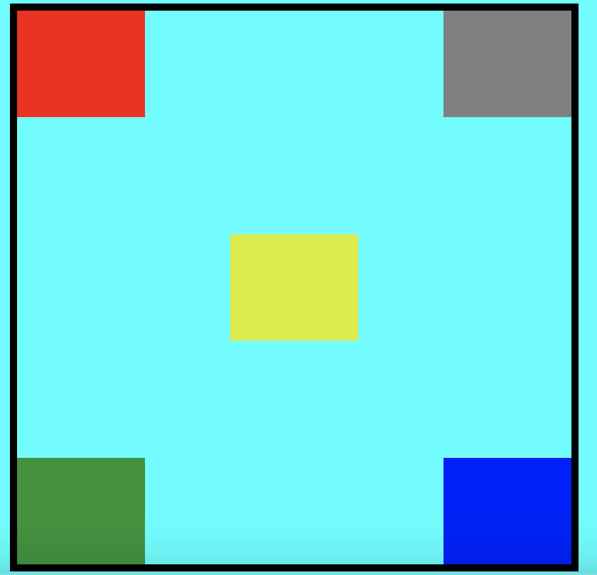

# Tarea #1: Posicionar con CSS 5 etiquetas div detro de una etiqueta section, cada etiqueta div deve quedar en cada esquina y una en el medio

#Ejemplo de la tarea

# Fecha de entrega: 31/07/2024

# Nota: Lo guardan dentro de una carpeta con su nombre completo de lo contrrio no sera aceptado.