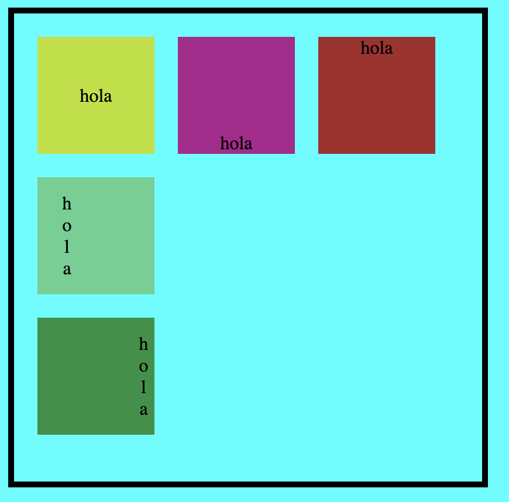

# Tarea #2: Posicionar con CSS 5 etiquetas div detro de una etiqueta section, cada etiqueta div debe quedar como se representa en la imagen adjuntada con su respectivo texto dentro de cada div.

# Ejemplo de la tarea

# Fecha de entrega: 16/08/2024

# Nota: Lo guardan dentro de una carpeta con su nombre completo de lo contrario no sera aceptado.