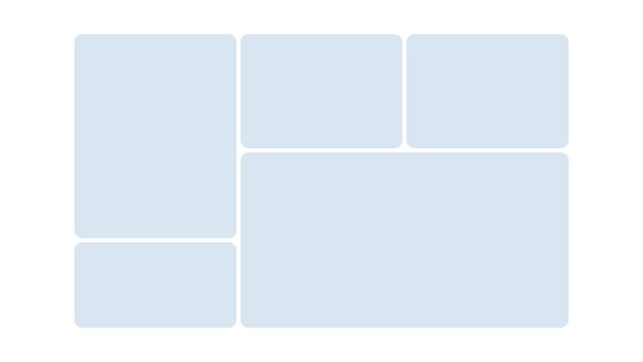

# Tarea #4: Realizar con CSS y HTML el Siguente diseño aplicando "GRID" y las propiedades:
* grid-column-start 
* grid-column-end s
* grid-row-start 
* grid-row-end.

# Ejemplo de la tarea

# Fecha de entrega: domingo 22/09/2024

# Nota: Lo guardan dentro de una carpeta con su nombre completo de lo contrario no sera aceptado.